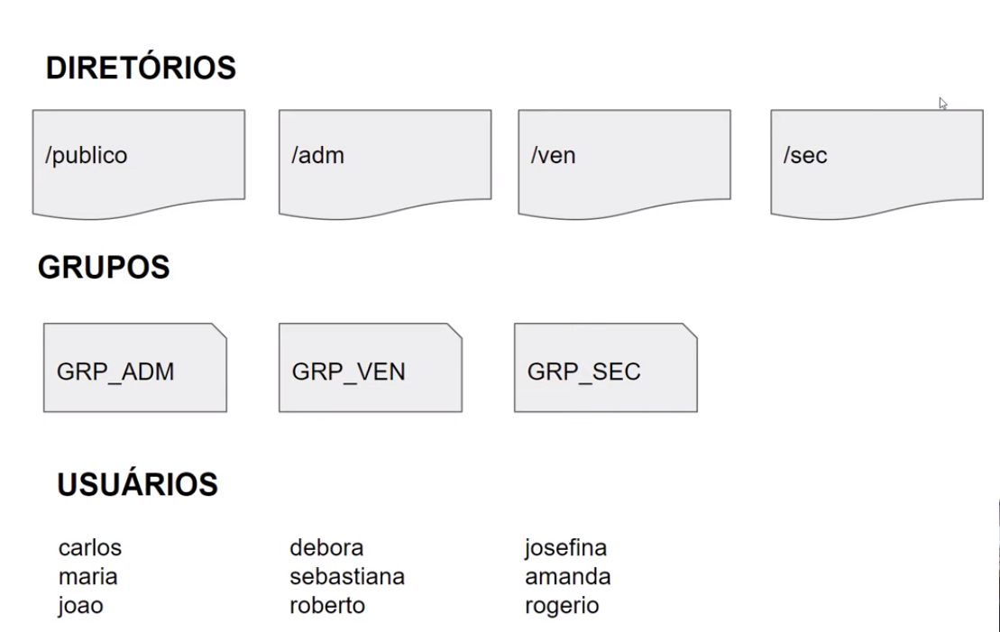

# Bash Scripts for Linux Server

## Objective of the project

This project aims to create a script that runs commands on the Linux server to create directories, directories and users, changing the access permissions and creating files.

The projects consists in the creation of a bash script to run commands on the Linux server to create directories, groups and users, changing the access permissions of access.

## Organization

### The requiremts of the script are the following:

* The owner of all directories will be root user.

* All users will have total permitions to the `/publico` directory.

* The users of each group will have total permitions to the directory corresponding to their group.

* The users will not have permitions to read, write or execute in directories that are not owned by them.

### The directory, group and users structure will be:

### Instructions:

* `/publico` - this directory will be public, it will contain files and directories that will be accessible to everyone.

* `/adm` - this directory will be used by the users of group GRP_ADM - carlos, maria and joao.

* `/ven` - this directory will be used by the users of group GRP_VEN - debora, sebastiana and roberto.

* `/sec` - this directory will be used by the users of group GRP_SEC - josefina, amanda and rogerio.

## Usage

This project was developed for didatics purposes.